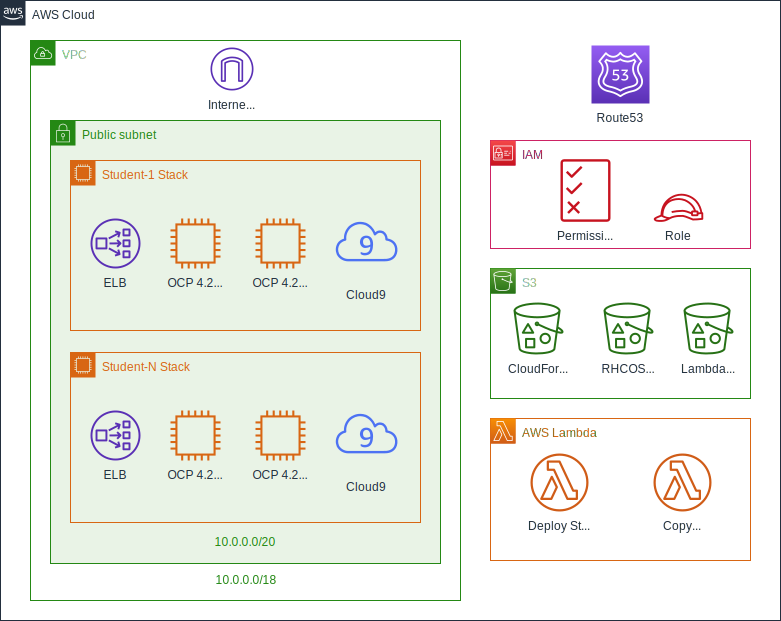

# aws-ocp

## Overview

The solution within this repository deploys an All-in-One(AIO) OpenShift 4.x cluster into an AWS region to be used as a lab or a training environment.



## Deployment

There are two ways to deploy - either using [taskcat](https://github.com/aws-quickstart/taskcat) or the CloudFormation console. CloudFormation console deployment expects this repository in an S3 bucket. Taskcat is a CLI based approach and requires the installation and configuration of the taskcat library. Tascat creates the S3 bucket for all of the CloudFormation assets, uploads the entire repo and deploys the stack.

### Deploy using CloudFormation

1. Upload this repository to an S3 bucket. Note the Object URL for the [aws-ocp-master.template.yml](templates/aws-ocp-master.template.yml) file.
2. Create a new CloudFormation stack by using the Object URL from step 1.
3. Fill out the deployment parameters and deploy the stack.
4. After the stack is done deploying, navigate to the *Ouputs* tab of the master deployment and use the *WorkshopWebpage* output to browse to the workshop webpage.

### Deploy using taskcat

1. Install taskcat by following the [taskcat installation instructions](https://aws-quickstart.github.io/install-taskcat.html)

2. Update the [parameter overrides](https://github.com/aws-quickstart/taskcat#parameter-overrides) by creating `<PROJECT_ROOT>/.taskcat_overrides.yml` file. Use the example below as a starting point:

```yaml
ClusterName: <CLUSTER NAME>
# Lock down access to the lab to a specific CIDR,
# defaults to 0.0.0.0/0
RemoteAccessCIDR: "73.42.71.116/32"
NumStudents: "2"
# Have to pass SSH key due to a RHCOS requirement
SSHKey: "<PASTE YOUR PUBLIC SSH KEY HERE>"
# Single quotes because the pull secret string contains double quotes
PullSecret: '<PASTE PULL SECRET HERE>'
```

3. Deploy the stack

```bash
# Runing the taskcat test command with -n flag creates the stack and doesn't destroy it
taskcat test run -n
```

### OCP 4.x Deployment Parameters

| Parameter        | Example                                 | Description                                                           |
| ---------------- | --------------------------------------- | --------------------------------------------------------------------- |
| OpenShiftVersion | "4.2"                                   | OpenShift version                                                     |
| ClusterName      | "ocp42class"                            | OpenShift cluster name                                                |
| HostedZoneName   | "openshift.awsworkshop.io"              | Route53 hosted zone name                                              |
| NumStudents      | "20"                                    | Number of student environments to provivision                         |
| PullSecret       | '{"auths":{"cloud.openshift.com": ... ' | Pull secret obtained from [cloud.redhat.com](https://cloud.redhat.com/openshift/install), it's big |
| SSHKey           | "ssh-rsa AAAAB3NzaC1ycAAA ..."          | Public SSH key for ssh access                                         |
| RhcosAmi         | "ami-08e10b201e19fd5e7"                 | RHCOS AMI ID                                                          |
| AvailabilityZone | "us-west-2a"                            | Has to correspond to the region                                       |
| PublicSubnetCIDR | "107.145.55.108/32"                     | Lock down access to the lab to a specific CIDR, defaults to 0.0.0.0/0 |
| QSS3BucketName   | "tcat-t3-test6-48ska2s"                 | S3 bucket for CloudFormation templates                                |
| QSS3KeyPrefix    | "aws-ocp/"                              | S3 bucket path for CloudFormation templates, mainly used for taskcat  |

## StackDirector Lambda

To debug ignition lambda run

```bash
export PULL_SECRET=<YOUR PULL SECRET>
export SSH_KEY=<YOUR PUBLIC SSH_KEY>
make run_lambda
```

## Troubleshooting

### Deleting massive scale stacks

Sometimes the StudentStack lambda can fail to clean up and you require a way to quickly remove the stacks. Here is some sample code to clean this up:

```python
    import boto3
    cf_client = boto3.client("cloudformation")
    cluster_name = "ClusterName input param"
    to_detel = cf_client.list_stacks(StackStatusFilter=["ROLLBACK_FAILED", "DELETE_FAILED"])
    for stack in to_detel["StackSummaries"]:
      if cluster_name in stack["StackName"]:
        response = cf_client.delete_stack(StackName=stack["StackName"])
        response["ResponseMetadata"]["HTTPStatusCode"]
```

### Taskcat

We have seen issues running taskcat under the following conditions, please verify:

  * Your Environment variables for AWS are what you want as they override your `~/.aws/credentials` and `~/.aws/config` * You have initialized and updated the git submodules
  * You Account has the correct IAM Permissions to execute in the region.
  * Your default region and test region match.

Then you need to be above the repository directory and execute, with make: `make test`. Without make:
`taskcat -c aws-ocp/ci/config.yml`. Notice it is outside the actual repository.

When running a lot of tests, the S3 buckets can begin to add up. To clean up all Taskcat buckets you can run the following:
`aws s3 ls | grep taskcat | cut -d ' ' -f 3 | xargs -I {} aws s3 rb s3://{} --force`

